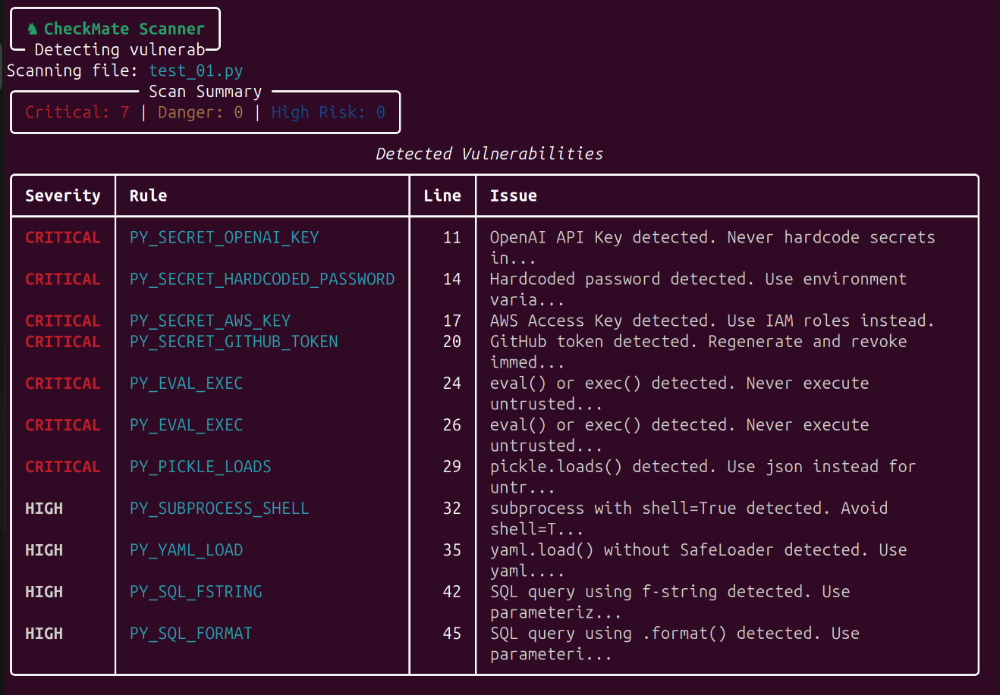

<div align="center">

```
   _____ _               _    __  __       _
  / ____| |             | |  |  \/  |     | |
 | |    | |__   ___  ___| | _| \  / | __ _| |_ ___
 | |    | '_ \ / _ \/ __| |/ / |\/| |/ _` | __/ _ \
 | |____| | | |  __/ (__|   <| |  | | (_| | ||  __/
  \_____|_| |_|\___|\___|_|\_\_|  |_|\__,_|\__\___|

    ♞ AI Code Security Scanner with Human-in-the-Loop
```

[](https://pypi.org/project/checkmate-ai/)
[](https://www.python.org/downloads/)
[](https://opensource.org/licenses/MIT)

</div>

---

<div align="center">

**Human-in-the-loop anomaly detection for AI-generated code.**
A professional CLI tool that scans code for security vulnerabilities, enables human review, and learns from feedback to improve detection accuracy.

```bash
pip install checkmate-ai
checkmate scan your_code.py
```



</div>

## 📌 Project Background

CheckMate was originally developed for a hackathon competition focused on human-in-the-loop anomaly detection. While we didn't win, we believe in the value of this tool and are continuing development as an open-source side project. Our goal is to build a practical, privacy-focused security scanner that helps developers catch vulnerabilities in AI-generated code.

## 🎯 The Problem

AI-generated code is powerful but risky:
- ❌ Hardcoded secrets (API keys, passwords)
- ❌ Code execution vulnerabilities (eval, exec, pickle)
- ❌ SQL injection patterns
- ❌ No built-in security checks

**CheckMate solves this** with automated detection + human judgment.

---

## 🚀 What Makes CheckMate Different

### Human-in-the-Loop Learning
```
Scan → Review Flags → Mark as Valid/False Positive → System Learns → Better Scans
```

- 📊 **Before/After Metrics** - See precision improve in real-time
- ✅ **Human Feedback Loop** - Mark false positives, build whitelist
- 🎯 **31 Detection Rules** - Across secrets, code execution, SQL injection
- 💾 **Persistent Learning** - Whitelist saves automatically
- 🌍 **Multi-Language** - Python & JavaScript support

---

## ⚡ Quick Start

### 1. Install (30 seconds)
```bash
pip install checkmate-ai
```

### 2. Start Dashboard (in Terminal 1)
```bash
checkmate dashboard
```
Browser opens automatically to http://localhost:3000 showing "Waiting for scan..."

### 3. Run Scanner (in Terminal 2)
```bash
checkmate scan demo.py
```

The dashboard updates automatically showing detected flags.

### 4. Review & Provide Feedback
- See code with syntax highlighting
- Read security explanations
- Click "Mark as Safe" to whitelist patterns
- View suggested fixes

### 5. Rescan & Watch Improvement
```bash
checkmate scan demo.py
```
Metrics page shows **precision improvement** (e.g., 62% → 84%)

---

## 📋 All CLI Commands

| Command | Purpose |
|---------|---------|
| `checkmate dashboard` | Start web UI + backend server |
| `checkmate scan <file>` | Scan single file |
| `checkmate scan file1.py file2.js` | Scan multiple files |
| `checkmate scan .` | Scan all .py and .js in current directory |
| `checkmate whitelist` | View current whitelist |
| `checkmate reset` | Clear all data (fresh start) |
| `checkmate version` | Show version info |

---

## ✨ Core Features

CheckMate delivers on all essential security scanning capabilities:

| Feature | Implementation |
|---------|---------------|
| **Problem Definition** | AI code security + human review = clear, valuable problem |
| **Anomaly Detection** | 31 rules across 3 categories (secrets, code exec, SQL injection) |
| **Human-in-Loop** | Users mark valid/false positive → whitelist updates → system learns |
| **Before/After Improvement** | Metrics page shows precision improvement (tracked over time) |
| **Explainability** | Each flag shows: explanation, severity, suggested fix, line number |
| **Presentation** | Professional CLI, web dashboard, polished UX |

---

## 🎨 Dashboard Features

### Results Page (/)
```
┌─────────────────────────────────────────┐
│ CheckMate - Security Scan Results       │
├─────────────────────────────────────────┤
│ File: demo.py                           │
│ Total Flags: 5                          │
│                                         │
│ [CRITICAL] Hardcoded API Key (Line 15) │
│ sk-1234567890abcdef                     │
│ Use: os.environ.get('OPENAI_API_KEY')   │
│ [Mark as Safe] [Copy Fix]               │
│                                         │
│ [DANGER] eval() Usage (Line 28)         │
│ eval("user_input")                      │
│ Use: ast.literal_eval() instead         │
│ [Mark as Safe] [Copy Fix]               │
└─────────────────────────────────────────┘
```

### Metrics Page (/metrics)
- **Precision Trend** - Line chart showing improvement over time
- **Stat Cards** - Total scans, total flags, precision %, improvement %
- **Before/After Card** - Visual improvement comparison
- **Per-Rule Breakdown** - Accuracy by detection rule

---

## 🔐 Detection Rules (31 Total)

### Category 1: Secrets (10 rules) 🔴 CRITICAL
- OpenAI API keys (`sk-...`)
- AWS Access Keys (`AKIA...`)
- Hardcoded passwords
- Private tokens, JWT secrets
- Firebase API keys
- Stripe API keys
- GitHub tokens
- And more...

### Category 2: Code Execution (14 rules) 🟠 DANGER
- `eval()` usage
- `exec()` usage
- `pickle.loads()` deserialization
- `subprocess` with shell=True
- `os.system()` calls
- Dynamic imports
- And more...

### Category 3: SQL Injection (7 rules) 🟡 HIGH RISK
- F-string SQL queries
- String concatenation in queries
- Variable interpolation in SQL
- And more...

---

## 📊 How the Feedback Loop Works

### Step 1: Initial Scan
```bash
checkmate scan code.py
# Detects: 5 flags
# Metrics: 3 valid, 2 false positives
# Precision: 60%
```

### Step 2: Human Review
- Dashboard shows each flag
- User reads explanation: "eval() can execute arbitrary code"
- User decides: "This is a false positive (test code)"
- Clicks: "Mark as Safe"

### Step 3: Whitelist Update
- Backend saves to `whitelist.json`
- Pattern added: `eval("test_value")`
- Next scan will skip this pattern

### Step 4: Rescan & Improvement
```bash
checkmate scan code.py
# Detects: 4 flags (1 skipped via whitelist)
# Metrics: 3 valid, 1 false positive (whitelisted)
# Precision: 75% (improved!)
```

### Step 5: Persistent Learning
- Precision tracked over time
- Metrics page shows trend: 60% → 75% → 84%
- Team learns what their codebase's real risks are

---

## 🏗️ Architecture

### Tech Stack
- **CLI**: Python 3.11+ with Click framework
- **Detection**: Regex-based (31 rules, no ML)
- **Backend**: FastAPI (lightweight API)
- **Dashboard**: Next.js 14 + React 18 + TypeScript
- **UI Components**: shadcn/ui + Tailwind CSS
- **Data**: SQLite database + JSON files

### Data Flow
```
Terminal (User)
    ↓
[checkmate scan file.py]
    ↓
CLI Scanner (runs detectors)
    ↓
FastAPI Backend (saves to DB)
    ↓
Browser (Next.js Dashboard)
    ↓
User Reviews & Marks Safe/False Positive
    ↓
Backend Updates Whitelist + Metrics
    ↓
Next Scan Reads Whitelist (skips patterns)
    ↓
Precision Improves ✅
```

---

## 📦 Installation & Setup

**For detailed setup instructions, see [SETUP.md](./SETUP.md)**

### Quick Install
```bash
# From PyPI (recommended)
pip install checkmate-ai
checkmate dashboard

# From source
git clone https://github.com/farhann-saleem/checkmate-ai
cd checkmate
pip install -e .
checkmate dashboard
```

---

## 🎬 Demo Walkthrough

1. **Open Terminal 1**
   ```bash
   checkmate dashboard
   ```
   Browser shows: "Waiting for scan..."

2. **Open Terminal 2**
   ```bash
   checkmate scan samples/vulnerable_1.py
   ```

3. **See Results** (browser auto-refreshes)
   - 5 flags detected
   - Severity badges, code snippets, suggestions

4. **Provide Feedback**
   - Click "Mark as Safe" on false positive
   - Watch whitelist update in real-time

5. **Rescan**
   ```bash
   checkmate scan samples/vulnerable_1.py
   ```
   - Flag count decreased
   - Metrics page shows precision improved

6. **View Metrics**
   - Navigate to `/metrics`
   - See precision trend chart
   - Before: 60% | After: 84%

---

## 📁 Project Structure

```
checkmate/
├── README.md                 # This file
├── SETUP.md                  # Installation guide
├── setup.py                  # PyPI packaging
├── pyproject.toml            # Modern Python standard
│
├── checkmate/                # Main package
│   ├── cli.py                # CLI entry point
│   ├── scanner.py            # Detection engine
│   └── detectors/            # 31 detection rules
│
├── backend/
│   ├── main.py               # FastAPI server
│   ├── database.py           # SQLite operations
│   ├── models.py             # Data models
│   └── routes/               # API endpoints
│
├── dashboard/                # Next.js web UI
│   ├── app/                  # Pages (/, /metrics)
│   └── components/           # UI components
│
├── data/                     # JSON storage
│   ├── scan_results.json
│   ├── whitelist.json
│   ├── feedback.json
│   └── metrics.json
│
└── samples/                  # Example vulnerable files
    ├── vulnerable_1.py
    ├── vulnerable_2.py
    └── vulnerable_3.js
```

---

## 🔗 Links

- 📦 **PyPI Package**: https://pypi.org/project/checkmate-ai/
- 🐙 **GitHub Repository**: https://github.com/farhann-saleem/checkmate-ai
- 📖 **Setup Guide**: [SETUP.md](./SETUP.md)
- 📋 **Product Requirements**: See [PRD.md](./PRD.md)

---

### Running the Demo

```bash
# Terminal 1
checkmate dashboard

# Terminal 2 (wait 3 seconds)
checkmate scan samples/vulnerable_1.py

# Browser shows results automatically
# Mark a false positive as safe
# Rescan to see improvement
```

**Time needed**: 2 minutes total

---

## 🤝 Contributing

Found a bug? Have a rule idea? Open a GitHub issue or PR!

---

## 📄 License

MIT License - See LICENSE file for details

---

## 💡 Future Enhancements

- Machine learning for adaptive rules
- More language support (Go, Java, Rust)
- Integration with CI/CD pipelines
- API for programmatic scanning
- Rule customization UI

---


**CheckMate** - Making AI-generated code safer, one scan at a time.
